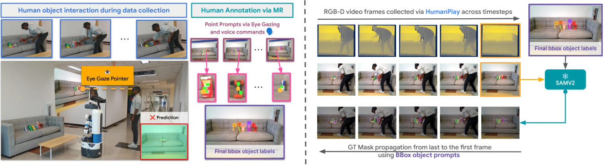
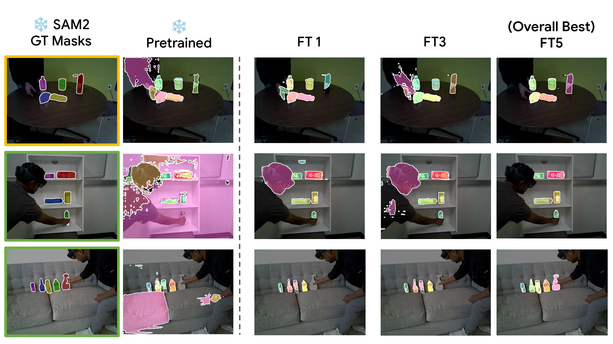

# iTeach-UOIS

## 📦 Datasets
- Download TOD, OCID, OSD, RobotPushing, iTeach-HumanPlay datasets from [here](https://utdallas.box.com/v/uois-datasets).
- Copy `OSD-0.2/` to `OSD-0.2-depth/` folder.
- Put all the data in the `DATA/` directory.

## 🔑 Checkpoints
- Download [UCN](https://arxiv.org/pdf/2007.15157) checkpoints from [here](https://utdallas.box.com/s/9vt68miar920hf36egeybfflzvt8c676).
- Download [MSM](https://arxiv.org/abs/2211.11679) and [Lu et al.](https://roboticsproceedings.org/rss19/p017.pdf) checkpoints from [here](https://utdallas.box.com/s/vzp8nmalowg4i58y8b9sghv5s7f36xpz).
- Put all the checkpoints in the `ckpts/` directory.

## ⚙️ Setup
```bash
# Clone the repo with submodules
git clone --recurse-submodules https://github.com/IRVLUTD/iTeach-UOIS

# Set environment variables
source ./set_env.sh
```

## 🐳 Docker
A [docker image](https://hub.docker.com/repository/docker/irvlutd/iteach) is provided:
```bash
cd docker
./run_container.sh
```
There are two Conda environments for the UOIS models (Python 3.8):
- `msm38` → `/opt/conda/envs/msm38`
- `ucn38` → `/opt/conda/envs/ucn38`

## 🐛 Known Error Fixes
If you encounter:
- `AttributeError: module 'PIL.Image' has no attribute 'LINEAR'`, run:
  ```bash
  pip install Pillow~=9.5
  ```
- `AttributeError: module 'distutils' has no attribute 'version'`, run:
  ```bash
  pip install setuptools==59.5.0
  ```
- `RuntimeError: Numpy is not available`, run:
  ```bash
  pip uninstall numpy && pip install numpy==1.23.1
  ```

### 📥 Download iTeach-HumanPlay Dataset
- **D5**: [Link](https://utdallas.box.com/v/iTeach-HumanPlay-D5)  
- **D40**: [Link](https://utdallas.box.com/v/iTeach-HumanPlay-D40)  
```bash
$ROOT_DIR/uois-models/UnseenObjectsWithMeanShift/data
ln -s <human-data-dir> humanplay_data
```

<center>iTeach-UOIS data capture and GT mask generation</center>

Modify `cfg.INPUT` in `config.py` for RGB or RGBD:
```bash
$ROOT_DIR/uois-models/UnseenObjectsWithMeanShift/lib/fcn/config.py
```

---
### 🏋️‍♂️ MSMFormer Training & Testing (with LoRA, RGB, RGBD)
```bash
cd MSMFormer

# Tabletop training (RGB)
python tabletop_train_net_pretrained.py --num-gpus 2 --dist-url tcp://127.0.0.1:12345     --cfg $ROOT_DIR/uois-models/UnseenObjectsWithMeanShift/MSMFormer/configs/humanplay_RGB.yaml --out_dir test_experiment

# LoRA (rgbd lora not possible due to package error)
python iteach_train_net_pretrained.py --num-gpus 1 --dist-url tcp://127.0.0.1:12345     --cfg $ROOT_DIR/uois-models/UnseenObjectsWithMeanShift/MSMFormer/configs/humanplay_RGBD.yaml --out_dir test_experiment --use_lora

# Test
python $ROOT_DIR/uois-models/UnseenObjectsWithMeanShift/lib/test_data.py
```

Run demo:
```bash
cd MSMFormer/
python ./lib/fcn/iteach_test_demo.py
```

### 🎯 Finetuning
- **RGB**:
  ```bash
  cd uois-models/UnseenObjectsWithMeanShift/;
  ./experiments/scripts/iteach.demo_msmformer_rgb_finetuned.sh test_experiment
  ```
- **RGBD**:
  ```bash
  cd uois-models/UnseenObjectsWithMeanShift/MSMFormer
  python iteach_train_net_pretrained.py --out_dir test_experiment --cfg configs/mixture_ResNet50.yaml
  ```

- Results get saved to:
  ```bash
  ../../MSMFormer/test_experiment
  ```

- ✨ Finetuned model ckpts are available:
  - **D5**: [Link](https://utdallas.box.com/v/iTeach-UOIS-D5-ckpts)
  - **D40**: [Link](https://utdallas.box.com/v/iTeach-UOIS-D40-ckpts)

- Test demo:
  ```bash
  cd uois-models/UnseenObjectsWithMeanShift/lib/fcn
  python iteach_test_demo.py
  ```
- Output from best finetuned model

<center>TableTop and BeyondTableTop: (Shelf, Sofa) scenes</center>

## 🙌 Works used
- [MSMFormer](https://github.com/IRVLUTD/UnseenObjectsWithMeanShift?tab=readme-ov-file#unseen-object-instance-segmentation-with-msmformer)
- [Self-Supervised-UOIS](https://github.com/IRVLUTD/UnseenObjectsWithMeanShift?tab=readme-ov-file#self-supervised-unseen-object-instance-segmentation-via-long-term-robot-interaction)
- [Robokit](https://github.com/jishnujayakumar/robokit)
- Note: [UCN](https://github.com/NVlabs/UnseenObjectClustering) exists in the submodules but has not been used in this work.
  - This is kept just in case of any future baseline comparison or extension.


## 📚 BibTex
Please cite ***iTeach*** if it helps your research 🙌:
```bibtex
@misc{padalunkal2024iteach,
    title={iTeach: Interactive Teaching for Robot Perception using Mixed Reality},
    author={Jishnu Jaykumar P and Cole Salvato and Vinaya Bomnale and Jikai Wang and Yu Xiang},
    year={2024},
    eprint={2410.09072},
    archivePrefix={arXiv},
    primaryClass={cs.RO}
}
```

## 📬 Contact
For any clarification, comments, or suggestions, you can choose from the following options:

- Join the [discussion forum](https://github.com/IRVLUTD/iTeach/discussions). 💬
- Report an [issue](https://github.com/IRVLUTD/iTeach/issues). 🛠️
- Contact [Jishnu](https://jishnujayakumar.github.io/). 📧

## 🙏 Acknowledgements
This work was supported by the DARPA Perceptually-enabled Task Guidance (PTG) Program under contract number HR00112220005, the Sony Research Award Program, and the National Science Foundation (NSF) under Grant No.2346528. We thank [Sai Haneesh Allu](https://saihaneeshallu.github.io/) and [Ninad Khargonkar](https://kninad.github.io/) for their assistance with the real-world experiments. 🙌
