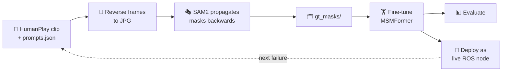
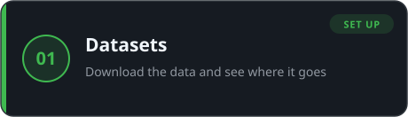
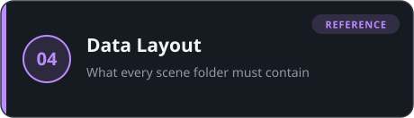
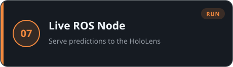
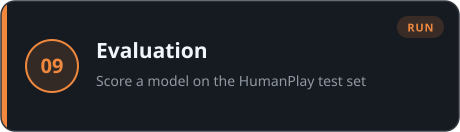
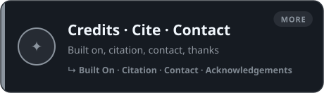
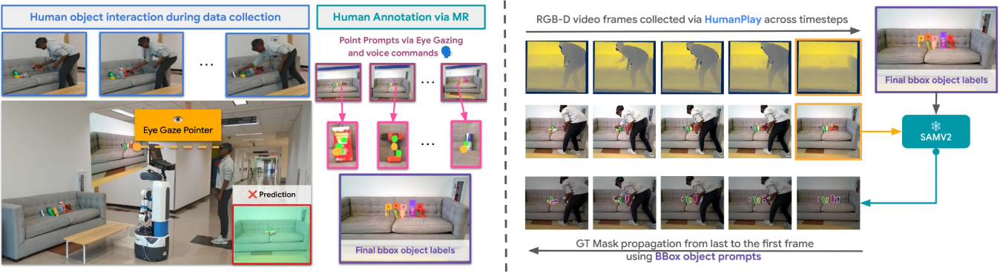
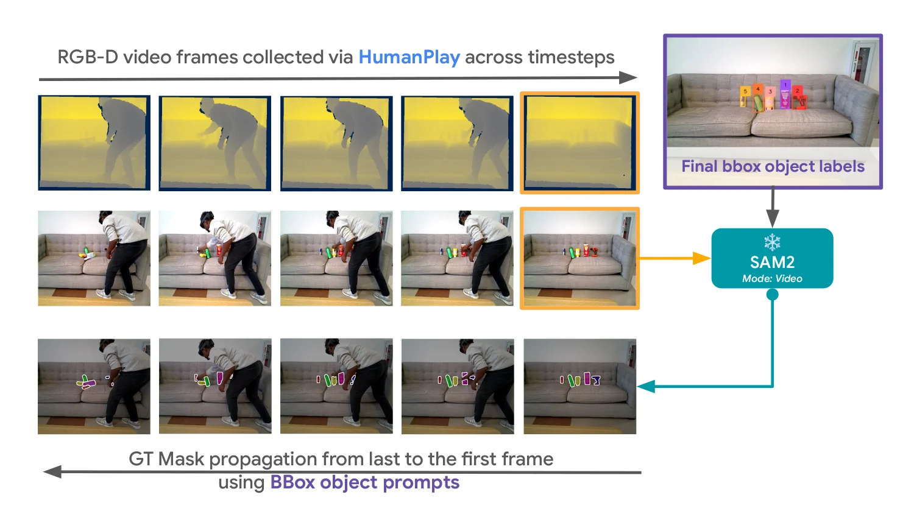

<div align="center">

# 🧠 iTeach-UOIS

### Unseen Object Instance Segmentation for [iTeach](https://irvlutd.github.io/iTeach/): from gaze prompts to a better robot

<br>

[](https://irvlutd.github.io/iTeach/)
[](https://arxiv.org/abs/2410.09072)
[](LICENSE)
[](https://hub.docker.com/r/irvlutd/iteach)


<br>

[**Data**](#-datasets) &nbsp;·&nbsp;
[**Checkpoints**](#-checkpoints) &nbsp;·&nbsp;
[**Setup**](#️-setup) &nbsp;·&nbsp;
[**GT Masks**](#-generating-ground-truth-masks-for-new-humanplay-scenes) &nbsp;·&nbsp;
[**Training**](#️-msmformer-training) &nbsp;·&nbsp;
[**Live Node**](#-live-ros-node-on-the-robot) &nbsp;·&nbsp;
[**Evaluation**](#-evaluation) &nbsp;·&nbsp;
[**Troubleshooting**](#-known-error-fixes)

</div>

<br>

This repo turns HumanPlay clips labelled on the HoloLens into **dense ground-truth masks** with SAM2, fine-tunes **MSMFormer** on them, and evaluates the result. It also runs MSMFormer as a **live ROS node**, which is how the robot's predictions reach the HoloLens.


```mermaid
flowchart LR
    A["🥽 HumanPlay clip<br/>+ prompts.json"] --> B["🔄 Reverse frames<br/>to JPG"]
    B --> C["🎭 SAM2 propagates<br/>masks backwards"]
    C --> D["🗂️ gt_masks/"]
    D --> E["🏋️ Fine-tune<br/>MSMFormer"]
    E --> F["📊 Evaluate"]
    E --> G["🤖 Deploy as<br/>live ROS node"]
    G -. "next failure" .-> A
```

<br>

## 🧩 Part of the iTeach Family

<table>
  <tr>
    <th width="33%"><a href="https://github.com/IRVLUTD/iTeach">📍 iTeach</a></th>
    <th width="33%"><a href="https://github.com/IRVLUTD/iTeachSkillsApp">🥽 iTeachSkillsApp</a></th>
    <th width="33%">🧠 iTeach-UOIS <sub>(this repo)</sub></th>
  </tr>
  <tr>
    <td>Project hub: overview, links, HoloLens and robot networking utilities</td>
    <td>HoloLens 2 app + ROS bridge: record HumanPlay, gaze + voice point prompts on the last frame</td>
    <td>Point prompts → SAM2 boxes → masks propagated backwards → MSMFormer fine-tuning → evaluation</td>
  </tr>
</table>

<br>

## 📑 Contents

<p align="center">
<a href="#-datasets"></a>
<a href="#-checkpoints"></a>
<a href="#️-setup"></a>
<a href="#️-iteach-humanplay-data-layout"></a>
<a href="#-generating-ground-truth-masks-for-new-humanplay-scenes"></a>
<a href="#️-msmformer-training"></a>
<a href="#-live-ros-node-on-the-robot"></a>
<a href="#-evaluation"></a>
<a href="#-known-error-fixes"></a>
<a href="#-built-on"></a>
</p>

<details>
<summary><b>🗂️ Full index</b> <sub>(every section and subsection as text links)</sub></summary>
<br>

<ol>
  <li><a href="#-datasets"><b>Datasets</b></a> · Download the data and see where it goes</li>
  <li><a href="#-checkpoints"><b>Checkpoints</b></a> · Pretrained and iTeach fine-tuned weights</li>
  <li><a href="#️-setup"><b>Setup</b></a> · Install with Docker or locally
    <ul>
    <li><a href="#-option-a-docker-recommended">Docker</a></li>
    <li><a href="#-option-b-local-install">Local install</a></li>
    </ul>
  </li>
  <li><a href="#️-iteach-humanplay-data-layout"><b>Data Layout</b></a> · What every scene folder must contain</li>
  <li><a href="#-generating-ground-truth-masks-for-new-humanplay-scenes"><b>Ground-Truth Masks</b></a> · Turn a new capture into labels with SAM2</li>
  <li><a href="#️-msmformer-training"><b>Training</b></a> · Fine-tune MSMFormer: RGB, RGB-D, LoRA</li>
  <li><a href="#-live-ros-node-on-the-robot"><b>Live ROS Node</b></a> · Serve predictions to the HoloLens</li>
  <li><a href="#-evaluation"><b>Evaluation</b></a> · Score a model on the HumanPlay test set</li>
  <li><a href="#-known-error-fixes"><b>Troubleshooting</b></a> · Fixes for common install and runtime errors</li>
  <li><a href="#-built-on">Built On</a> · <a href="#-license">License</a> · <a href="#-citation">Citation</a> · <a href="#-contact">Contact</a> · <a href="#-acknowledgements">Thanks</a></li>
</ol>

</details>

<br>

---

<br>

## 📦 Datasets

| Dataset | Link |
|:--|:--|
| **All UOIS datasets** (TOD, OCID, OSD, RobotPushing, iTeach-HumanPlay) | [Download](https://utdallas.box.com/v/uois-datasets) |
| iTeach-HumanPlay **D5** · 5 controlled scenes | [Download](https://utdallas.box.com/v/iTeach-HumanPlay-D5) |
| iTeach-HumanPlay **D40** · 40 scenes | [Download](https://utdallas.box.com/v/iTeach-HumanPlay-D40) |
| iTeach-HumanPlay **Test** · 902 samples, 3 held-out scenes | [Download](https://utdallas.box.com/v/iTeach-HumanPlay-Test) |

<br>

Put everything under `DATA/` at the repo root:

```
DATA/
├── tabletop_dataset_v5_public/
├── OCID-dataset/
├── OSD-0.2-depth/                 # copy of OSD-0.2/ (the loaders read the depth variant)
├── self-supervised-segmentation/  # RobotPushing; set_env.sh renames training/ → training_set/, testing/ → test_set/
└── iTeach-HumanPlay/
    ├── training_set/scene*/       # the D5 / D40 scenes you train on
    └── test_set/scene*/           # held-out test scenes
```

> [!IMPORTANT]
> The HumanPlay folders must be named **`training_set/`** and **`test_set/`**, with scene folders named **`scene*`**.

<br>

<div align="right"><sub><a href="#-contents">⬆ back to contents</a></sub></div>

---

<br>

## 🔑 Checkpoints

| Checkpoints | Link |
|:--|:--|
| [UCN](https://arxiv.org/pdf/2007.15157) | [Download](https://utdallas.box.com/s/9vt68miar920hf36egeybfflzvt8c676) |
| [MSMFormer](https://arxiv.org/abs/2211.11679) and [Lu et al.](https://roboticsproceedings.org/rss19/p017.pdf) | [Download](https://utdallas.box.com/s/vzp8nmalowg4i58y8b9sghv5s7f36xpz) |
| ✨ **iTeach fine-tuned MSMFormer · D5** | [Download](https://utdallas.box.com/v/iTeach-UOIS-D5-ckpts) |
| ✨ **iTeach fine-tuned MSMFormer · D40** | [Download](https://utdallas.box.com/v/iTeach-UOIS-D40-ckpts) |

<br>

Put them under `ckpts/`. `set_env.sh` expects:

```
ckpts/
├── checkpoints/
├── rgb_pretrain/     rgb_finetuned/
└── rgbd_pretrain/    rgbd_finetuned/
```

<br>

<div align="right"><sub><a href="#-contents">⬆ back to contents</a></sub></div>

---

<br>

## ⚙️ Setup

```bash
# Clone (the UOIS models are vendored under uois-models/, no submodules needed)
git clone https://github.com/IRVLUTD/iTeach-UOIS
cd iTeach-UOIS

# Environment variables + data/checkpoint symlinks.
# Run from the repo root, after DATA/ and ckpts/ are in place. Safe to re-run.
source ./set_env.sh
```

<sub>Among other things, `set_env.sh` links `DATA/iTeach-HumanPlay` → `uois-models/UnseenObjectsWithMeanShift/data/humanplay_data`, which is where the HumanPlay loader looks.</sub>

<br>

### 🐳 Option A: Docker (recommended)

> [!TIP]
> The Docker image has the exact package versions used for the paper, so it is the most reliable way to reproduce the results.

```bash
cd docker
./run_container.sh
```

| | |
|:--|:--|
| **Image** | [`irvlutd/iteach:uois-peft`](https://hub.docker.com/r/irvlutd/iteach) (~32 GB) |
| **Needs** | NVIDIA GPU + [NVIDIA Container Toolkit](https://docs.nvidia.com/datacenter/cloud-native/container-toolkit/latest/install-guide.html) |
| **Conda envs** (Python 3.8) | `msm38` → `/opt/conda/envs/msm38` · `ucn38` → `/opt/conda/envs/ucn38` |

<sub>The Dockerfile for `irvlutd/iteach:uois-peft` is not in this repository. The published image is the reference environment.</sub>

<br>

### 🧰 Option B: Local install

You need two environments:

**1. MSMFormer**
- Python 3.8, a CUDA build of PyTorch, and [detectron2](https://detectron2.readthedocs.io/en/latest/tutorials/install.html) built for that same PyTorch/CUDA version
- `pip install -r uois-models/UnseenObjectsWithMeanShift/requirement.txt`
- Compile the MSDeformAttn op: `cd uois-models/UnseenObjectsWithMeanShift/MSMFormer/meanshiftformer/modeling/pixel_decoder/ops && sh make.sh`
- `pip install peft` if you want `--use_lora`
- More details: [MSMFormer README](uois-models/UnseenObjectsWithMeanShift/README.md)

**2. robokit** (SAM2 mask propagation)
- See [robokit/README.md](robokit/README.md)

<br>

<div align="right"><sub><a href="#-contents">⬆ back to contents</a></sub></div>

---

<br>

## 🗂️ iTeach-HumanPlay Data Layout

Every scene, whether released or newly captured, looks like this:

```
scene_XXX/
├── rgb/000000.png, 000001.png, …   # 640×480 RGB, zero-padded sequential names in time order
├── depth/000000.png, …             # 16-bit depth in millimetres, same names as rgb/
├── gt_masks/000000.png, …          # instance label maps (0 = background), same names as rgb/
└── prompts.json                    # HoloLens point prompts + SAM2 boxes for the last frame
```

> [!IMPORTANT]
> The loader (`lib/datasets/humanplay_dataset.py`) reads every `rgb/*.png` and finds its label and depth images by replacing `rgb` with `gt_masks` / `depth` in the path. **File names in the three folders must match exactly.**

<br>

<p align="center">
  
  <br>
  <sub><i>iTeach-UOIS data capture and GT mask generation</i></sub>
</p>

<br>

<div align="right"><sub><a href="#-contents">⬆ back to contents</a></sub></div>

---

<br>

## 🎭 Generating ground-truth masks for new HumanPlay scenes

> [!NOTE]
> The released datasets **already include `gt_masks/`**. You only need this section for scenes you capture yourself.

<p align="center">
  
  <br>
  <sub><i>SAM2 (video mode) propagates masks backwards from the final annotated frame to all earlier frames, producing dense per-frame supervision.</i></sub>
</p>

<br>

**Step 1: Capture and label**

Record and label a scene with [iTeachSkillsApp](https://github.com/IRVLUTD/iTeachSkillsApp). You get `rgb/`, `depth/` and a `prompts.json` with `bboxes_xyxy` (SAM2 boxes on the **last** frame). Arrange them in the [layout above](#️-iteach-humanplay-data-layout).

<br>

**Step 2: Reverse the frames into JPGs**

The last RGB frame becomes `jpg/000000.jpg`, so the prompts on the last frame seed the propagation.

```bash
cd robokit
python convert2jpg_in_reverse.py --input_dir <scene_dir>
```

<br>

**Step 3: Propagate the masks backwards**

```bash
python propogate_masks_via_bbox_prompt_samv2.py --input_dir <scene_dir>/jpg
```

This reads `<scene_dir>/prompts.json["bboxes_xyxy"]` and writes `<scene_dir>/gsam2/{masks, palette, bbox_overlay, rgb_and_mask}/`. It then symlinks `<scene_dir>/gt_masks` → `gsam2/masks`, with the masks named in the original (forward) frame order.

<br>

**Step 4: Check the masks**

Look through `gsam2/rgb_and_mask/` before training. 👀

<br>

<sub>`data-preprocessing/get_gsam2_human_labelled_gt_masks.sh` is a record of an earlier sanity-check experiment (GroundingDINO + SAM2). It was <b>not</b> used for any reported result.</sub>

<br>

<div align="right"><sub><a href="#-contents">⬆ back to contents</a></sub></div>

---

<br>

## 🏋️ MSMFormer Training

**1. Select the input modality.** Set `__C.INPUT` in `uois-models/UnseenObjectsWithMeanShift/lib/fcn/config.py`:

| Modality | `__C.INPUT` | Config |
|:--|:--|:--|
| RGB | `'COLOR'` | `MSMFormer/configs/humanplay_RGB.yaml` |
| RGB-D | `'RGBD'` | `MSMFormer/configs/humanplay_RGBD.yaml` |

<br>

**2. Train.**

```bash
cd $ROOT_DIR/uois-models/UnseenObjectsWithMeanShift/MSMFormer

# RGB fine-tuning on HumanPlay
python tabletop_train_net_pretrained.py --num-gpus 2 --dist-url tcp://127.0.0.1:12345 \
    --cfg $ROOT_DIR/uois-models/UnseenObjectsWithMeanShift/MSMFormer/configs/humanplay_RGB.yaml \
    --out_dir test_experiment

# RGB-D fine-tuning on HumanPlay
python iteach_train_net_pretrained.py --num-gpus 1 --dist-url tcp://127.0.0.1:12345 \
    --cfg $ROOT_DIR/uois-models/UnseenObjectsWithMeanShift/MSMFormer/configs/humanplay_RGBD.yaml \
    --out_dir test_experiment
```

Checkpoints and `config.yaml` are saved to `uois-models/UnseenObjectsWithMeanShift/MSMFormer/<out_dir>/`.

> [!TIP]
> **LoRA:** add `--use_lora` to `iteach_train_net_pretrained.py` to fine-tune with LoRA adapters (needs `pip install peft`). In the original experiments, RGB-D + LoRA failed with a package error.

<br>

**3. See it work.** Qualitative demo on a test scene (run from `uois-models/UnseenObjectsWithMeanShift`):

```bash
./experiments/scripts/hp.iteach.demo_msmformer_rgbd_finetuned.sh <out_dir> data/humanplay_data/test_set/<scene>
./experiments/scripts/hp.iteach.demo_msmformer_rgb_finetuned.sh  <out_dir> data/humanplay_data/test_set/<scene>
```

<sub>These scripts load a fixed iteration (`model_0001999.pth` for RGB-D, `model_0000999.pth` for RGB). Edit `--pretrained` if your run saved different iterations.</sub>

<br>

<p align="center">
  
  <br>
  <sub><i>Left → right: ground truth, pretrained MSMFormer, and iTeach fine-tuning rounds FT1, FT3, FT5, on tabletop, shelf and sofa scenes.</i></sub>
</p>

<br>

<div align="right"><sub><a href="#-contents">⬆ back to contents</a></sub></div>

---

<br>

## 🤖 Live ROS node on the robot

During an iTeach session, MSMFormer runs on the laptop as a **ROS node**. It subscribes to the Fetch RGB-D topics and publishes predictions (`/seg_image_refined`, `/seg_image`, `/seg_label`, …), which the HoloLens displays via [iTeachSkillsApp](https://github.com/IRVLUTD/iTeachSkillsApp#-running-the-live-system-on-the-robot).

```bash
# The laptop is a ROS client of the robot:
#   ROS_MASTER_URI=http://<robot-ip>:11311   ROS_HOSTNAME=<laptop-ip>
cd $ROOT_DIR/uois-models/UnseenObjectsWithMeanShift
./experiments/scripts/ros_seg_transformer_test_segmentation_fetch.sh <gpu_id> <task_name> [--save]
```

| Option | Effect |
|:--|:--|
| `--save` | Also write frames and predictions to `output/<task_name>/` |
| `f0` block (default) | Pretrained MSMFormer |
| `f1` / `f2` blocks | Models fine-tuned after each iTeach round (`new_ckpts/f*/model_final.pth`) |

<br>

<p align="center">
  
  <br>
  <sub><i>Downstream on the robot: iTeach-UOIS segmentation feeds GTO motion planning and grasping, turning perception gains into reliable picks and places.</i></sub>
</p>

<br>

<div align="right"><sub><a href="#-contents">⬆ back to contents</a></sub></div>

---

<br>

## 📊 Evaluation

Evaluate a fine-tuned model (`MSMFormer/<out_dir>/model_final.pth`) on the HumanPlay test set (`data/humanplay_data/test_set`):

```bash
cd $ROOT_DIR/uois-models/UnseenObjectsWithMeanShift/lib/fcn
python iteach_test_dataset.py <out_dir>
# → MSMFormer/<out_dir>/model_results/results.json
```

To evaluate **every** `model_*.pth` in a set of run directories, use `iteach_get_results_all_models.py`. Adjust the `glob` pattern at the top of its `__main__` block to point at your runs.

<br>

The **combined score** (`lib/fcn/combined_score.py`):

```math
\text{combined} = 0.4 \cdot F_{\text{objects}} + 0.4 \cdot F_{\text{boundary}} + 0.2 \cdot \text{Det}_{@0.75}
```

<sub>where Det@0.75 is the percentage of objects detected at 0.75 overlap.</sub>

> [!NOTE]
> **Reference result (paper):** iTeach fine-tuning lifts the UOIS combined score from **26.1 → 80.7** (**+54.6**, **3.1×**). Downstream on SceneReplica, grasping success goes **71 → 74** and pick & place **65 → 72** (out of 100).

<br>

<div align="right"><sub><a href="#-contents">⬆ back to contents</a></sub></div>

---

<br>

## 🐛 Known Error Fixes

| Error | Fix |
|:--|:--|
| `AttributeError: module 'PIL.Image' has no attribute 'LINEAR'` | `pip install Pillow~=9.5` |
| `AttributeError: module 'distutils' has no attribute 'version'` | `pip install setuptools==59.5.0` |
| `RuntimeError: Numpy is not available` | `pip uninstall numpy && pip install numpy==1.23.1` |

<br>

<div align="right"><sub><a href="#-contents">⬆ back to contents</a></sub></div>

---

<br>

## 🙌 Built On

- [MSMFormer](https://github.com/IRVLUTD/UnseenObjectsWithMeanShift?tab=readme-ov-file#unseen-object-instance-segmentation-with-msmformer)
- [Self-Supervised-UOIS](https://github.com/IRVLUTD/UnseenObjectsWithMeanShift?tab=readme-ov-file#self-supervised-unseen-object-instance-segmentation-via-long-term-robot-interaction)
- [Robokit](https://github.com/jishnujayakumar/robokit)
- [SAM2](https://github.com/facebookresearch/sam2)

<sub>[UCN](https://github.com/NVlabs/UnseenObjectClustering) is included under `uois-models/` but was not used in this work. It is kept for possible baseline comparisons or extensions.</sub>

<br>

## 📜 License

Released under the [**MIT License**](LICENSE), © 2024-2026 Intelligent Robotics and Vision Lab (IRVL), The University of Texas at Dallas.

<sub>Third-party code keeps its own license: [MSMFormer](uois-models/UnseenObjectsWithMeanShift/LICENSE.md) (MIT), [UCN](uois-models/UnseenObjectClustering/LICENSE.md) (**NVIDIA Source Code License, non-commercial**), and [robokit](robokit/LICENSE) (MIT).</sub>

<br>

## 📚 Citation

If ***iTeach*** helps your research, please cite:

```bibtex
@misc{padalunkal2024iteach,
  title         = {iTeach: In the Wild Interactive Teaching for Failure-Driven Adaptation of Robot Perception},
  author        = {Jishnu Jaykumar P and Cole Salvato and Vinaya Bomnale and Jikai Wang and Ayush Bhardwaj and Jin-Ryong Kim and Yu Xiang},
  year          = {2026},
  eprint        = {2410.09072},
  archivePrefix = {arXiv},
  primaryClass  = {cs.RO},
  url           = {https://arxiv.org/abs/2410.09072}
}
```

<br>

## 📬 Contact

| | |
|:--|:--|
| 💬 Questions & ideas | [Discussion forum](https://github.com/IRVLUTD/iTeach/discussions) |
| 🛠️ Bugs | [Open an issue](https://github.com/IRVLUTD/iTeach/issues) |
| 📧 Direct | [Jishnu](https://jishnujayakumar.github.io/) |

<br>

## 🙏 Acknowledgements

This work was supported by the DARPA Perceptually-enabled Task Guidance (PTG) Program under contract number HR00112220005, the Sony Research Award Program, and the National Science Foundation (NSF) under Grant No. 2346528. We thank [Sai Haneesh Allu](https://saihaneeshallu.github.io/) for assistance with the real-world experiments.

<br>

<div align="center">
<sub>Built at the <a href="https://labs.utdallas.edu/irvl/">Intelligent Robotics and Vision Lab</a>, The University of Texas at Dallas</sub>
</div>
